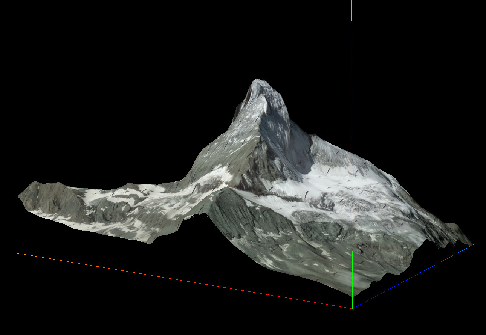
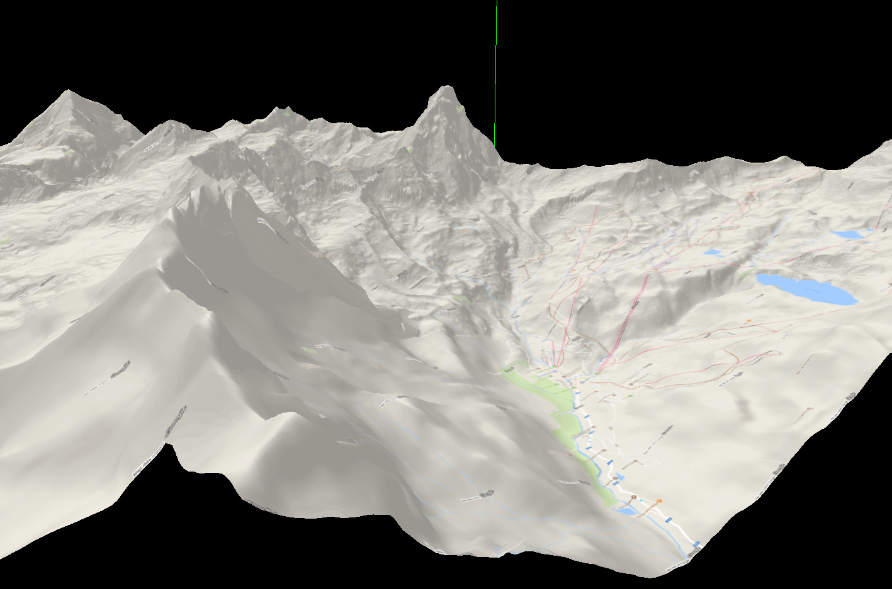

# Heightmap

Tool for creation of 3D map of terrain from raster [DEM](https://en.wikipedia.org/wiki/Digital_elevation_model) files. Implementation adopts [three.js](https://threejs.org/), a 3D javascript library.

It supports all raster **DEM files** format (.hgt, .bil, etc..) and all resolutions (3 arc seconds, 1 arc seconds, or more) with big/little endianness where each file describes a LATxLON sector.

Tool decorates the map with Google®'s texture at various resolutions (zoom).

## Example

[Click to see example](https://disaverio.github.io/DEM_heightmap/example) of [Matterhorn](https://en.wikipedia.org/wiki/Matterhorn)!

Screenshot with two different textures:

Sat texture, from Nort-West:



Terrain texture, from South-East:



## Use

`three.js` lib is bundled in compiled file, so all you have to do is include `DemHeightmap.js` with direct include in html page or with an AMD loader.

Then create an instance of `DemHeightmap` passing it a configuration object, and invoke `.render()` method:

```js
define(['DemHeightmap'], function (DemHeightmap) {
    requirejs(['domReady!'], function (document) {
        
        var configuration = { /* ... */ }
        
        var dh = new DemHeightmap(configuration);
        dh.render(45.976581, 7.658447); // Matterhorn coordinates
        
    });
});
```

### Configuration object

```js
/**
 * @param {Object} configuration {
 *     demType,                 // {String}, selected type, one of keys of this.dem object.                                                     // Default: 'hgt'
 *     googleApiKey,            // {String}, your google API key, mandatory if this.render.type == "texture".
 *     dem: {                   // {Object}, describes where retrieve dem files, where each key is a demType. Mandatory.
 *         KEY: {               // {Object}, key of single configuration, referred by this.demType
 *             format,          // {String}, file extension.
 *             folder,          // {String}, files folder.
 *             filename,        // {String}, filename pattern, with "{{NS}}", "{{LAT}}", "{{WE}}", "{{LON}}" as vars: see example.
 *             endianness,      // {String}, endianness of file. Allowed values: "little", "big".
 *             uppercaseName,   // {boolean}, specifies if filenames are in uppercase.
 *             overlap          // {boolean}, specifies if dem files overlap on last row/column (usually they do).
 *         }
 *     },
 *     render: {                // {Object}, configuration for render
 *         zoom,                // {Integer}, defines area dimension, like in Google® map. Allowed values: `11` to `20`.                        // Default: 12
 *         detailsLevel,        // {Integer}, defines details of Google® textures. Allowed values: `0` to `4`.                                  // Default: 0
 *         textureType,         // {String}, defines type of texture. Allowed values: 'terrain', 'satellite', 'roadmap', 'hybrid' from Google®. // Default: 'satellite'
 *         size,                // {Integer}, defines size in px of single texture, from Google®. Max allowed value 640.                        // Default: 512
 *         scaleFactor:         // {Number}, defines rescalation of elevations.                                                                 // Default: 1
 *         withAnimation,       // {boolean}, if true map elevation is animated.                                                                // Default: true
 *         type,                // {String}, defines type of rendering: Allowed values: 'texture', 'grid', 'points'.                            // Default: 'texture'
 *         output: {            // {Object}, configuration for render output
 *             width,           // {Integer} width of rendered map.                                                                             // Default: document.width - 20
               height,          // {Integer} height of rendered map.                                                                            // Default: document.height - 20
 *             htmlEl:          // {String}, id of html element where map will be rendered.                                                     // Default: 'map-container'
 *         }
 *     }
 * }
```

#### .render(LAT, LON[, renderConfig])

`DemHeightmap#render` method accepts three parameters:

`LAT`, `LON`: Numbers, center coordinates, mandatories.

`renderConfig` an object with **same** structure of `mainConfiguration.render` passed to constructor: if present general `render` configuration will be overriden.

### Other

Tool uses [async](https://github.com/disaverio/async) as lightweight [Q](https://github.com/kriskowal/q) replacement for async calls management.